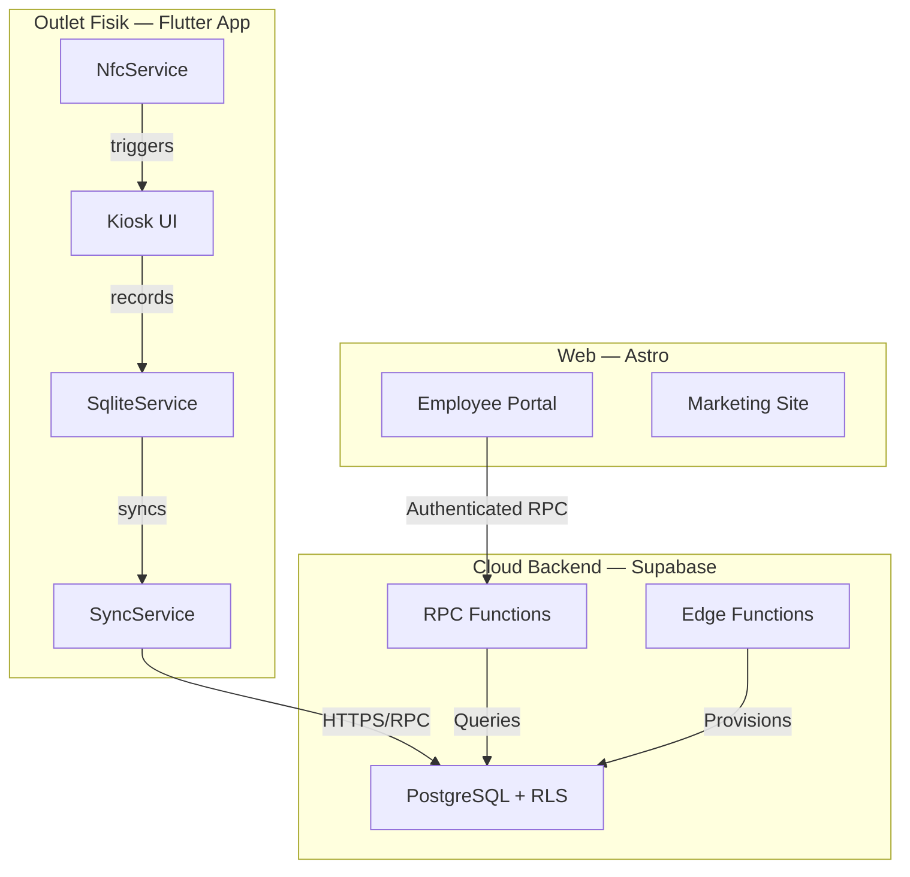
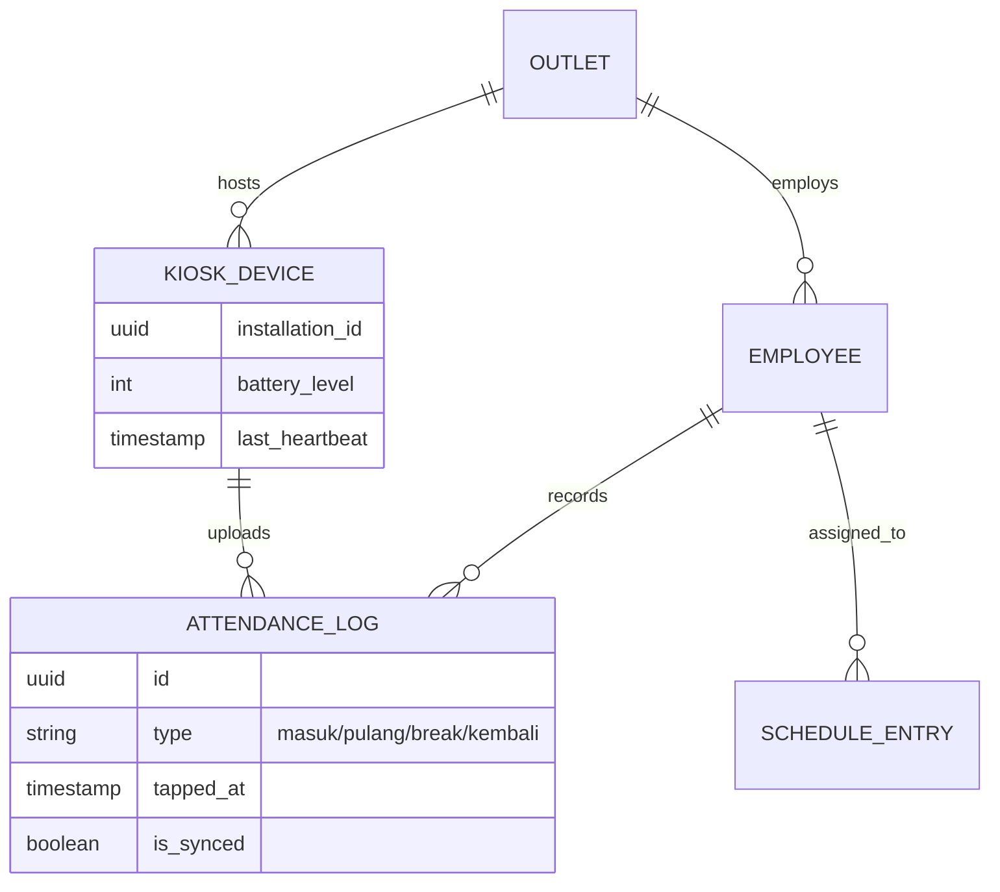

# ABSENKOK — Sistem Absensi NFC Ayam Guling Enakko

ABSENKOK (Absensi Enakko) adalah platform manajemen kehadiran berbasis NFC untuk jaringan restoran **Ayam Guling Enakko**. Sistem ini menggantikan absensi kertas tradisional dengan solusi 24/7 yang berjalan tanpa pengawasan, mendukung shift malam lintas hari, dan memberikan visibilitas real-time bagi admin di seluruh outlet.

## Stakeholder

| Peran | Deskripsi |
|:---|:---|
| **Karyawan** | Tap kartu NFC di kiosk, lihat jadwal & rekap via portal web |
| **Kepala Gerai** | Kelola staf dan pantau kehadiran per outlet |
| **Admin** | Kelola seluruh jaringan, perangkat, dan generate laporan PDF/CSV |

## Arsitektur



### 1. Flutter Kiosk App (Android)

Aplikasi Android yang di-deploy pada tablet di setiap outlet sebagai terminal absensi NFC.

- **Offline-first** — Log disimpan ke SQLite lokal, di-sync ke Supabase saat koneksi tersedia
- **Background service** — `KioskBackgroundService` menjaga heartbeat & status sync 24/7
- **Overlay pill** — Floating "Dynamic Island" untuk feedback real-time (scan confirmation, fun facts)
- **Admin suite** — Dashboard, manajemen karyawan, jadwal, badge, rekap harian, laporan PDF/CSV
- **NFC noise filtering** — Sentry logic untuk ignore hardware disconnect yang tidak relevan
- **Biometric auth** — Fingerprint/face untuk akses admin panel

### 2. Astro Web Portal

Website modern dengan Astro 5 + Tailwind CSS v4, di-host di Vercel.

- **Marketing site** — Landing page publik dengan fitur, cara kerja, arsitektur, dan link download APK
- **Employee portal** — Area terproteksi untuk karyawan: lihat jadwal, rekap kehadiran, streak & leaderboard
- **Passwordless auth** — Login deterministik berbasis UUID karyawan, tanpa password yang perlu diingat
- **SSR** — Server-Side Rendering untuk keamanan data dan akurasi real-time

### 3. Supabase Backend

- **PostgreSQL** — Database utama dengan Row Level Security (RLS) per role
- **RPC Functions** — `get_portal_attendance_recap`, `resolve_portal_employee`, dsb.
- **Edge Functions** — Admin provisioning dan operasi backend lainnya
- **Realtime** — Notifikasi dan update langsung

## Konsep Domain Utama

| Konsep | Penjelasan |
|:---|:---|
| **Logical Day (Noon Rule)** | Shift sebelum 12:00 dikelompokkan ke hari kalender sebelumnya — mendukung shift malam |
| **Overnight Pulang Repair** | SQL logic mencocokkan clock-out pagi ke clock-in malam hari sebelumnya |
| **Sedang Bekerja** | Status shift aktif yang menekan alarm "missing clock-out" |
| **Backup Mode** | Clock-in di outlet bukan home outlet, dengan catatan manual |
| **Follow-up Gaps** | Scan yang hilang (Absence/No Clock-out) yang butuh tindakan admin |
| **Streak System** | Gamifikasi tracking hari kehadiran berturut-turut |
| **Sparkline** | Visualisasi 14-hari riwayat kehadiran |

## Data Model



## Kosakata Domain

| Istilah | English | Deskripsi |
|:---|:---|:---|
| **Masuk** | Clock-in | Mulai shift kerja |
| **Pulang** | Clock-out | Akhiri shift kerja |
| **Break** | Break Start | Mulai istirahat |
| **Kembali** | Break End | Kembali dari istirahat |
| **Sakit** | Sick Leave | Izin sakit, dicatat oleh admin |
| **Izin** | Personal Leave | Izin pribadi |
| **Gerai / Outlet** | Branch / Store | Lokasi restoran fisik tempat kiosk di-deploy |
| **Kepala Gerai** | Branch Manager | Role terbatas untuk mengelola outlet tertentu |

## Struktur Repositori

Repo ini menyimpan dua codebase dalam satu monorepo:

| Direktori / File | Tanggung Jawab | Teknologi |
|:---|:---|:---|
| `lib/`, `android/`, `assets/`, `test/` | Kiosk Application | Flutter / Dart |
| `src/`, `public/` | Web Portal & Marketing Site | Astro 5 / TypeScript |
| `supabase/` | Edge Functions & Migrations | Deno / TypeScript |
| `sql/` | Database schema migrations & RPC | PostgreSQL / PLpgSQL |
| `.planning/` | Roadmap, research, architecture docs | Markdown |
| `pubspec.yaml` | Flutter dependency management | YAML |
| `package.json` | Astro & Node.js dependency management | JSON |

## Tech Stack

| Layer | Teknologi |
|:---|:---|
| Mobile App | Flutter, Dart, Riverpod, SQLite, NFC Manager |
| Web Frontend | Astro 5, Tailwind CSS v4, TypeScript |
| Backend | Supabase (PostgreSQL, Auth, Edge Functions, Realtime) |
| Hosting | Vercel (web), GitHub Releases (APK) |
| Error Tracking | Sentry |
| CI/CD | Vercel auto-deploy, GitHub Actions |

## Menjalankan Flutter App

Prasyarat:

- Flutter SDK terpasang
- Android SDK / emulator
- File `.env` tersedia (lihat `.env.example`)

```bash
flutter pub get
flutter run
```

Perintah tambahan:

```bash
flutter test          # Jalankan test suite
flutter analyze       # Static analysis
flutter build apk --release  # Build release APK
```

### Environment Variables (Flutter)

Buat file `.env` di root repo berdasarkan `.env.example`:

```
SUPABASE_URL=https://your-project-ref.supabase.co
SUPABASE_ANON_KEY=your-supabase-anon-key
KIOSK_JWT=your-kiosk-jwt
SENTRY_DSN=your-sentry-dsn
```

## Menjalankan Website Astro

Prasyarat:

- Node.js dan npm terpasang
- File `.env` tersedia

```bash
npm install
npm run dev
```

Perintah tambahan:

```bash
npm run build     # Production build
npm run preview   # Preview production build
npm run check     # TypeScript type-check
```

### Environment Variables (Astro)

| Variable | Deskripsi | Dibutuhkan |
|:---|:---|:---|
| `SUPABASE_URL` | URL project Supabase | Ya |
| `SUPABASE_ANON_KEY` | Anon key Supabase | Ya |
| `SUPABASE_SERVICE_ROLE_KEY` | Service role key (untuk portal auth provisioning) | Portal only |
| `PUBLIC_SUPABASE_URL` | Fallback kompatibilitas | Opsional |
| `PUBLIC_SUPABASE_ANON_KEY` | Fallback kompatibilitas | Opsional |

Untuk local development, copy `.env.example` → `.env` lalu isi nilainya.
Untuk Vercel, isi env yang sama di **Project Settings > Environment Variables**.

## Keamanan

| Layer | Flutter Kiosk App | Astro Web Portal |
|:---|:---|:---|
| **Primary Auth** | Supabase Email/Password | Passwordless (Deterministic Credentials) |
| **Secondary Auth** | Biometric (Fingerprint/Face) | SSR Session (Astro Middleware) |
| **Authorization** | App Metadata Roles (`admin`, `kepala_gerai`) | RLS + `resolve_portal_employee` RPC |
| **Persistence** | SharedPreferences (Role Caching) | Secure HTTP-only Cookies |

## Testing

Test suite Flutter terletak di direktori `test/`, mengikuti struktur `lib/`:

| Kategori | Lokasi | Tujuan |
|:---|:---|:---|
| Unit Tests | `test/services/`, `test/models/` | Validasi pure functions, parsing, logic |
| Widget Tests | `test/widgets/`, `test/screens/` | Verifikasi UI rendering & interaksi |
| Provider Tests | `test/providers/` | Test Riverpod state management |

```bash
flutter test                  # Jalankan semua test
flutter test test/services/   # Test services saja
```

## Branch yang Disarankan

| Branch | Deskripsi |
|:---|:---|
| `main` | Snapshot gabungan — Flutter app + Astro website |
| `app-flutter` | Branch bersih untuk history aplikasi Flutter |
| `website-astro` | Branch bersih untuk history website Astro |

## Wiki

Dokumentasi lengkap tersedia di [Wiki](../../wiki) repository ini, mencakup:

- System Overview & Architecture
- Flutter Kiosk Application (scan flow, NFC, offline sync, admin screens)
- Astro Web Portal (auth, schedule, attendance recap, gamification)
- Supabase Backend (schema, RPC, RLS, edge functions)
- Analytics, Reporting & Gamification
- Security & Authentication
- Testing
- Glossary

## Lisensi

Hak cipta © Ayam Guling Enakko. Internal use only.
